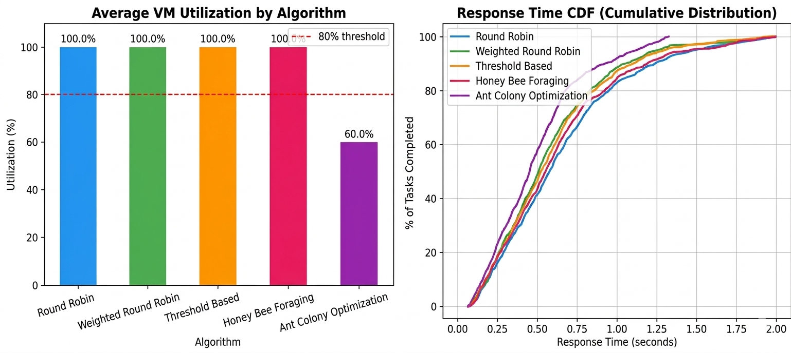

# ☁️ LoadSim: A Smart Load Balancing Simulator


---

## 📌 About The Project

Deployed: [](https://load-balancing-algo-server-8gagqd3dd3ztzbjyyakwbx.streamlit.app/)

This project simulates a **cloud datacenter environment** and compares the performance of **5 load balancing algorithms** under different workload conditions.Tasks (Cloudlets) arrive continuously using a **Poisson process** and are distributed across Virtual Machines (VMs) by each algorithm. Performance metrics like response time, processing time, wait time and VM utilization are collected and visualized for comparison.
Built entirely in **Python** using **SimPy** for discrete-event simulation and **Streamlit** for the interactive dashboard.



---

## 🎯 Algorithms Implemented

| # | Algorithm | Type | Key Idea |
|---|---|---|---|
| 1 | **Round Robin** | Stateless | Circular rotation — ignores load |
| 2 | **Weighted Round Robin** | Weight-aware | Proportional to VM capacity |
| 3 | **Threshold Based** | Load-aware | Avoids VMs above 80% utilization |
| 4 | **Honey Bee Foraging** | Nature-inspired | Probabilistic selection by nectar (free slots) |
| 5 | **Ant Colony Optimization** | Self-learning | Pheromone trails reinforce fast VMs |

---

## 📊 Performance Metrics Tracked

- **Average / Min / Max Response Time** — arrival to completion
- **Average / Min / Max Processing Time** — start to completion
- **Average Wait Time** — queue waiting time
- **Per-VM Utilization %** — how busy each VM was
- **Tasks Completed** — out of total tasks submitted

---

## 🏆 Key Results

### Medium Load (1000 Tasks, 20 tasks/sec)

| Algorithm | Avg Response Time | Wait Time |
|---|---|---|
| 🏆 ACO | **0.5207s** | 0.0064s |
| Weighted RR | 0.5692s | 0.0000s |
| Threshold | 0.5807s | 0.0000s |
| Honey Bee | 0.6049s | 0.0000s |
| Round Robin | 0.6427s | 0.0000s |

### High Load (2000 Tasks, 40 tasks/sec)

| Algorithm | Avg Response Time | Wait Time |
|---|---|---|
| 🏆 Threshold | **0.5663s** | 0.0000s |
| Weighted RR | 0.5693s | 0.0027s |
| Honey Bee | 0.5851s | 0.0000s |
| ACO | 0.6401s | 0.1295s |
| Round Robin | 1.0665s | 0.4285s |

> **Key Finding:** No single algorithm wins in all conditions — ACO excels at medium load, Threshold Based wins at high load, and Round Robin is consistently the worst performer.

---

## 🗂️ Project Structure

```
cloud_lb_sim/
├── app.py               ← Streamlit Dashboard (UI)
├── main.py              ← Entry point (CLI)
├── simulation.py        ← Core SimPy engine
├── models.py            ← VM, Cloudlet, Datacenter classes
├── metrics.py           ← Console table + CSV export
├── visualize.py         ← Matplotlib charts
├── requirements.txt     ← Dependencies
└── algorithms/
    ├── __init__.py
    ├── round_robin.py   ← Round Robin
    ├── weighted_rr.py   ← Weighted Round Robin
    ├── threshold.py     ← Threshold Based
    ├── honeybee.py      ← Honey Bee Foraging
    └── aco.py           ← Ant Colony Optimization
```

---

## ⚙️ How It Works

```
Tasks arrive (Poisson process)
        ↓
Load Balancer selects VM using algorithm
        ↓
SimPy executes: time = task_length (MI) / vm.mips
        ↓
Timestamps recorded: arrival → start → finish
        ↓
After all tasks → metrics calculated → charts generated
```

### VM Configuration (Default)

```python
VM-1 → 1000 MIPS  weight=1  (slow)
VM-2 → 2000 MIPS  weight=2  (medium)
VM-3 → 3000 MIPS  weight=3  (fast)
VM-4 → 1500 MIPS  weight=2  (medium)
VM-5 → 2500 MIPS  weight=2  (fast-ish)
```

---

## 🚀 Getting Started

### Prerequisites

```
Python 3.9 or above
```

### Installation

```bash
# Clone the repository
git clone https://github.com/yourusername/cloud-lb-simulator.git

# Navigate to project folder
cd cloud-lb-simulator

# Install dependencies
pip install -r requirements.txt
```

### Run CLI Simulation

```bash
python main.py
```

### Run Streamlit Dashboard

```bash
streamlit run app.py
```

---

## 📦 Dependencies

```
simpy>=4.1.1        # Discrete-event simulation engine
matplotlib>=3.7.0   # Static chart generation
numpy>=1.24.0       # Numerical operations
streamlit           # Interactive web dashboard
plotly              # Interactive charts
pandas              # Data handling and CSV export
```

Install all at once:

```bash
pip install simpy matplotlib numpy streamlit plotly pandas
```

---

## 🖥️ Streamlit Dashboard Features

- **Sidebar sliders** — configure tasks, arrival rate, VM count, task length live
- **Per-VM settings** — edit MIPS and weight for each VM individually
- **Algorithm params** — tune Threshold %, Honey Bee abandon limit, ACO alpha/beta/rho/Q
- **Live simulation** — click Run and all results update instantly
- **6 Interactive Plotly charts** — zoom, hover, and explore data
- **Metrics table** — side by side comparison with 🏆 winner highlighted
- **CSV download** — export full results with one click

---

## 📈 Charts Generated

| # | Chart | What It Shows |
|---|---|---|
| 1 | Avg Response Time | Bar chart per algorithm |
| 2 | Avg Processing Time | Bar chart per algorithm |
| 3 | Avg VM Utilization | Bar chart with 80% threshold line |
| 4 | Response Time Range | Min / Avg / Max grouped bars |
| 5 | VM Utilization Heatmap | Per-VM utilization matrix |
| 6 | Response Time CDF | Cumulative distribution of all tasks |

---

## 🔧 Configuration

Edit the `CONFIG` section in `main.py`:

```python
VM_CONFIGS = [
    (vm_id, mips, capacity, weight),
    ...
]
NUM_TASKS        = 1000     # total tasks
AVG_ARRIVAL_RATE = 20.0     # tasks per second (Poisson λ)
MIN_TASK_LENGTH  = 200.0    # MI (million instructions)
MAX_TASK_LENGTH  = 2000.0   # MI
SEED             = 42       # for reproducibility
```

---

## 📐 Core Formulas

### Execution Time
```
exec_time = task_length (MI) / vm.mips (MIPS)
```

### Response Time
```
response_time = finish_time - arrival_time
```

### Processing Time
```
processing_time = finish_time - start_time
```

### Wait Time
```
wait_time = start_time - arrival_time
```

### VM Utilization
```
utilization (%) = (total_busy_time / sim_duration) × 100
```

### Honey Bee — Nectar & Probability
```
nectar(VMi) = capacity - current_load
P(VMi)      = nectar(VMi) / Σ nectar(all VMs)
```

### ACO — Selection Probability
```
P(VMi) = [τ(VMi)^α × η(VMi)^β] / Σ [τ(VMj)^α × η(VMj)^β]

where:
τ = pheromone level
η = heuristic (free slots / capacity)
α = pheromone weight (default 1.0)
β = heuristic weight (default 2.0)
```

---

## 🔬 Simulation Methodology

This project uses **Discrete Event Simulation (DES)** via SimPy. Tasks are synthetic workloads generated using a **Poisson process** with exponential inter-arrival times — the standard approach in cloud computing research because:

- Provides **controlled and reproducible** conditions
- Allows all 5 algorithms to run on the **exact same workload**
- No infrastructure cost — everything runs locally
- Results are **statistically valid** and comparable

---

## 🌍 Real World Equivalents

| Algorithm | Real World Usage |
|---|---|
| Round Robin | Basic Nginx, DNS load balancing |
| Weighted RR | Production Nginx, HAProxy |
| Threshold Based | AWS Auto Scaling, Kubernetes HPA |
| Honey Bee | Experimental cloud schedulers |
| ACO | Google Borg, Network routing optimization |

---

## 👨‍💻 Developer

* **Maroof Gadiwale** – IT Student | Aspiring Data Scientist | ML Engineer ❤️

---

<div align="center">
  <p>⭐ Feel free to use! ⭐</p>
</div>
